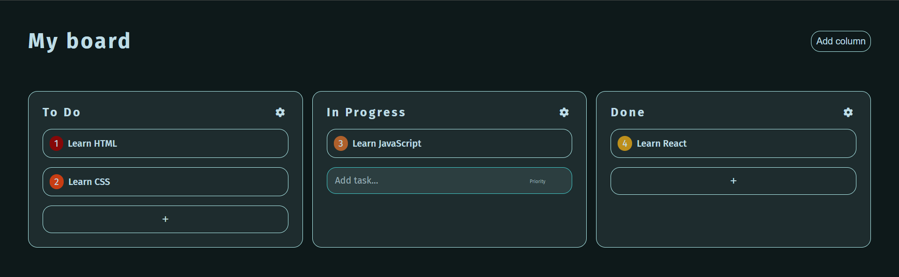
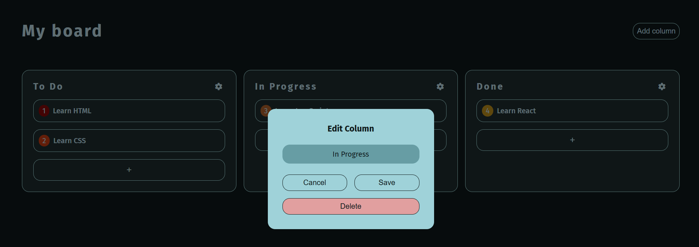

# Kanban Board (React + TypeScript)

## Project Description

This project is an interactive **Kanban board** for task management, similar to Trello. Users can create, edit, and delete **columns** and **tasks**, as well as drag and drop tasks between columns. The board’s state is saved in **localStorage**, allowing users to retain their data between sessions.

### Live Demo

Check out the live version of the Kanban Board here: [Live Demo](https://trcn-kanban.netlify.app/)

---


## Technologies

* **React** 
* **TypeScript**
* **CSS Modules**
* **LocalStorage API** for saving and loading board state

---

## Features

* **Columns**

    * Add new columns
    * Edit column titles
    * Delete columns
  

* **Tasks**

    * Add, edit, and delete tasks
    * Select a task to reveal action buttons
    * Priority levels (1–5) with color-coded display


* **Drag-and-drop**

    * Move tasks between columns
    * Reorder tasks within a column


* **Data persistence**

    * Board state automatically saved in `localStorage`


* **User Interface**

    * Modal windows for adding and editing columns
    * Action buttons for tasks (edit, delete) appear when selected

---
## Screenshots

Main board view with columns and tasks



Editing a column using modal window



---

## Project Structure

```
src/
│
├─ components/                  # React components (each component may have its own .module.css file)
│  ├─ Board.tsx                 # Main board component
│  ├─ Column.tsx                # Column component with tasks
│  ├─ Task.tsx                  # Individual task component
│  ├─ AddTaskForm.tsx           # Form for adding/editing tasks
│  ├─ ActionButtons.tsx         # Buttons for editing/deleting tasks
│  └─ ModalColumn.tsx           # Modal window for editing a column
│
├─ types.ts                      # Type definitions for Board, Column, and Task
├─ initialData.ts                # Initial board data
├─ localStorage.ts               # Helper functions to save/load board state
├─ App.tsx                       # Main App component
├─ App.css                       # Styles for App.tsx
├─ index.css                     # Global styles
└─ main.tsx                      # Entry point of the application
```

---

## Installation

1. **Install dependencies**

```bash
npm install
```

2. **Start the development server**

```bash
npm run dev
```

3. **Open in browser**

```
http://localhost:5173
```
---


